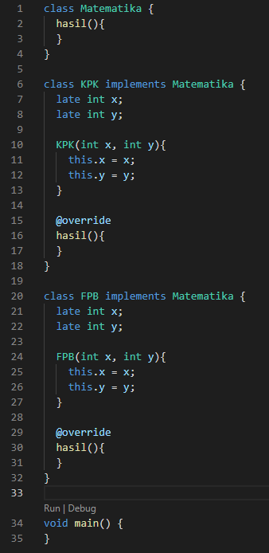

# 10_Dart_Object_Oriented_Programming_2

# Essay

## Task

### Buat Class dengan spesifikasi dari task 1
Untuk task pertama ini disuruh untuk mengimplementasikan super class BangunRuang dengan inheritance class kubus dan balok.
Pertama saya buat terlebih dahulu sesuai dengan spesifikasi lalu menambahkan constractor pada class BangunRuang dan kubus.

### Dari rangkaian class dari task 1 buat Overriding method dan selesaikan void mainnya
Di task kedua ini saya menambahkan method Overriding pada class kubus dan balok untuk mengambil method volume yang ada pada super class(BangunRuang), lalu menyelesaikan void main dengan sesuai screenshoot.

### Buat Class dengan spesifikasi dari task 3
Pada task ketiga mirip dengan task 1 namun kali ini saya langsung menambahkan Overriding pada class KPK dan FPB untuk mengambil method yang ada pada class matematika. 

### Dari rangkaian class dari task 3 selesaikan void mainnya
Di task terakhir ini saya menambahkan method getLCM dan gcd pada class KPK untuk menentukan KPK dari angka yang akan di check nilai KPKnya.
Untuk class FPB saya menambahkan method gcd untuk mencari nilai FPB dari angka yang akan di check nilai FPBnya.
Setelah itu saya menyelesaikan void mainnya seperti yang ada di screenshoot.

# Resume
- Mempelajari Inheritance, Interface, Abstract class.
- Mempelajari Method Overriding.
- Mempelajari Polymosphism dan generics.
