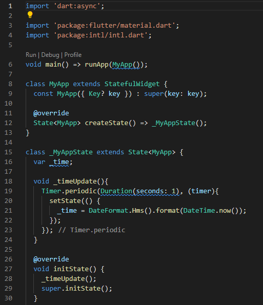
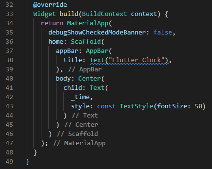
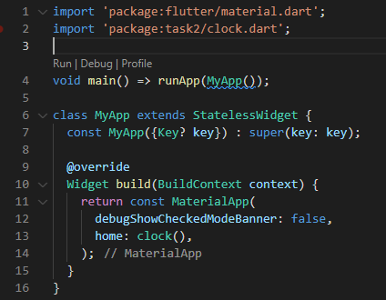
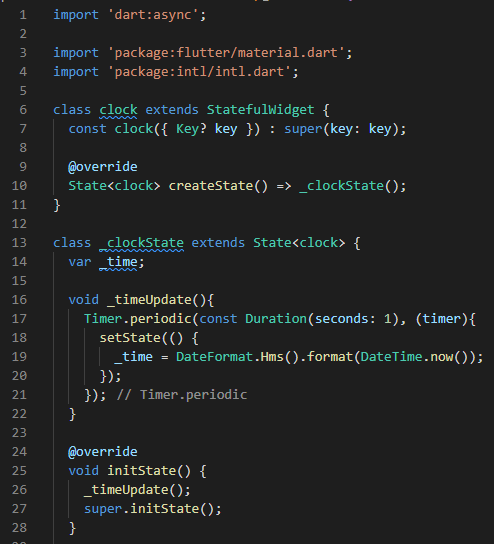
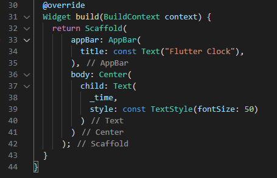

# 11_Introduction Flutter Widget

# Essay

## Task

### Buat Widget dengan isinya yaitu jam sesuai dengan real life
Di task pertama ini harus menggunakan stateful widget, jadi saya pertama saya mengimport library async dan intl untuk jam waktu dunianya,
setelah itu saya membuat stateful widget lalu membuat fungsi _timeUpdate_ untuk menstatekan waktunya. menambahkan initState untuk memulai waktunya.
Untuk bagian UI nya saya membuat sangat simple bisa dilihat di output di bawah.

### Dari widget task 1 pisahkan widgetnya tanpa mengubah tampilannya
Di task kedua ini saya mengubah kodingan dimainnya hanya materialApp dan homenya lalu saya membuat class clock untuk menyimpan tampilan waktunya.

# Resume
- Mempelajari Cara membuat flutter app
- Mempelajari Stateless dan stateful widget
- Mempelajari MaterialAPp, Scaffold, AppBar, Text dan Hasil 
