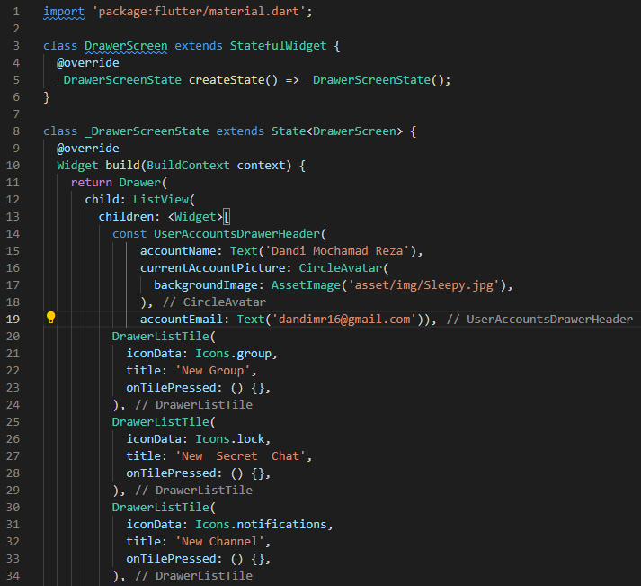
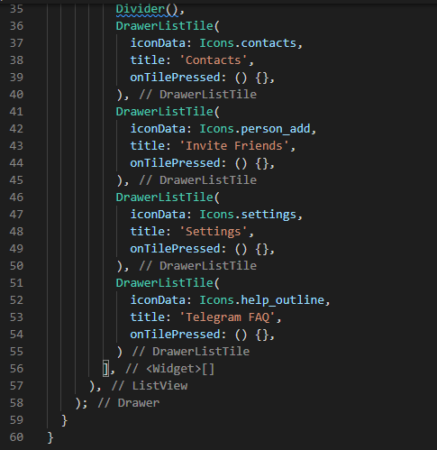
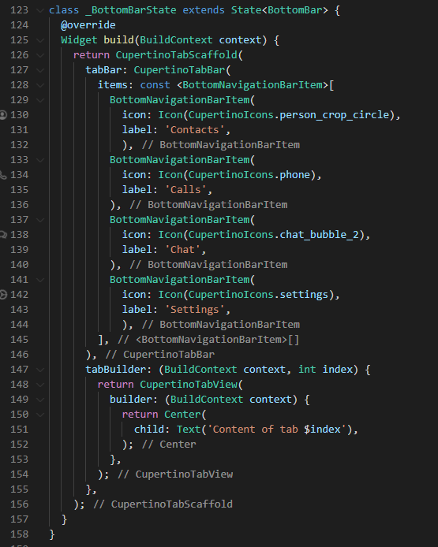

# 12_Platform Widget

# Essay

## Task

### Buat tampilan telegram
Di task pertama ini saya membuat 4 file yaitu main, HomePage, DrawerScreen dan ChartModel.
main untuk menjalankan appnya,
HomePage itu untuk tampilan utamanya beserta list chat,
DrawerScreen untuk tab pojok kiri di telegram,
ChartModel untuk data list chat

### Buat tampilan telegram menggunakan Cupertino
Di task kedua ini saya membuat 1 file saja yaitu main, isinya masih belum sempurna tetapi hampir selesai sekitar 80% untuk prosesnya bisa dilihat discreenshoot.

# Resume
- Mempelajari Platform widget dari android dan ios
- Mempelajari Perbedaan widget android dan ios
- Mempelajari cara membuat widget android dan ios
