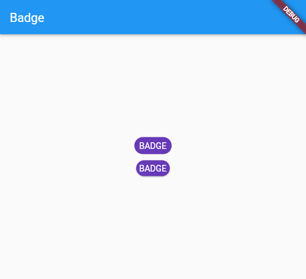
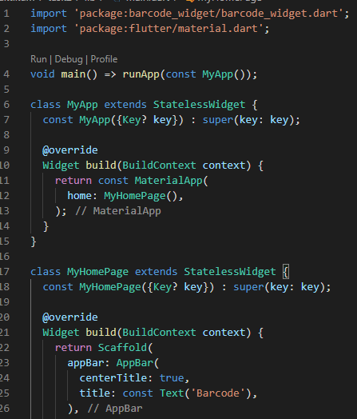

# 13_Flutter_Command_Line_Interface_(CLI)_and_Flutter_package_management

# Essay

## Task

### Buat tampilan badges menggunakan packages di pub.dev
Di task pertama ini saya mengimport dependancies dari pub.dev ke pubspec.yaml, setelah itu saya membuat stateless widget untuk packages widget saya import terlebih dahulu lalu untuk isinya saya isi di children. Untuk kodingan dan tampilannya bisa dilihat di screenshoot.

### Buat tampilan barcodes sesuai ketentuan dengan import packages dari pub.dev
Di task kedua ini sama seperti task1 saya import dependancies terlebih dahulu dan membuat stateless widget lalu import. Setelah itu saya membuat barcode sesuai ketentuan yaitu barcode pertama "Alterra Acdemy", kedua "Flutter Asik" dan ketiga nama sendiri(Dandi Mochamad Reza). Untuk hasilnya bisa dilihat di screenshoot.

# Resume
- Mempelajari Flutter Command Line Interface(CLI)
- Mempelajari CLI yang penting seperti 'Flutter Doctor'
- Mempelajari Packages Flutter yang ada di website pub.dev
