# 14_Flutter_Layout

# Essay

## Task

### Buat tampilan UI menggunakan ListView
Di task pertama ini mirip dengan task 1 pada section 12 jadi saya menggunakan source code yang hampir mirip hanya menghapus dan mengubah beberapa kodingan saja hasilnya bisa dilihat di screenshoot.
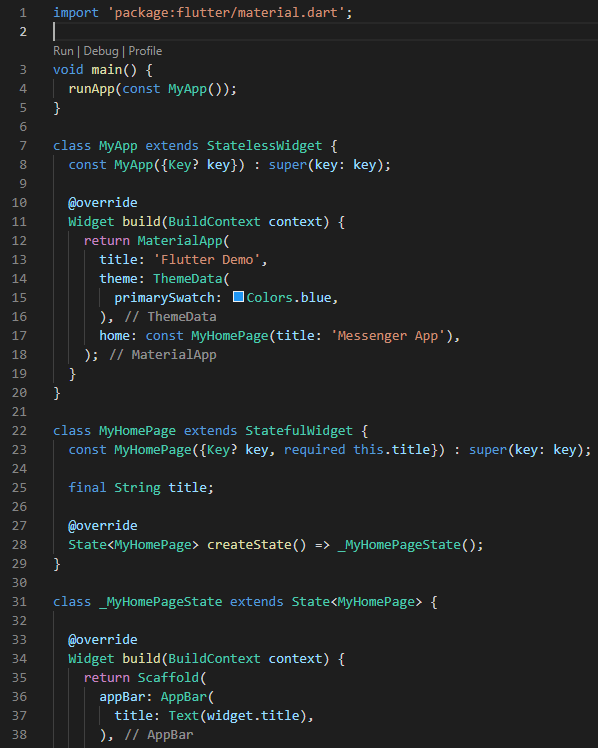
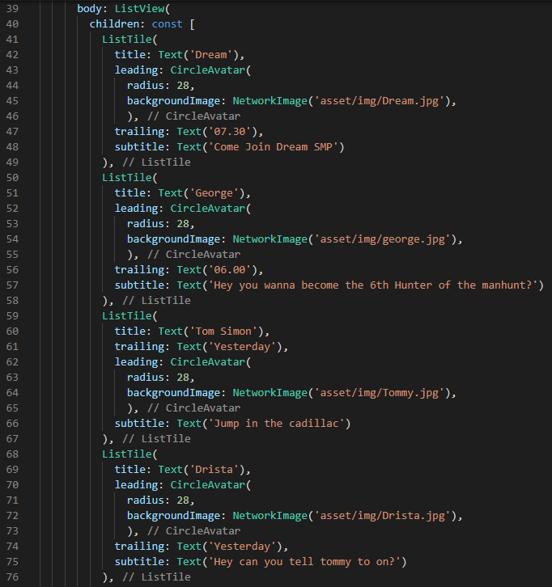
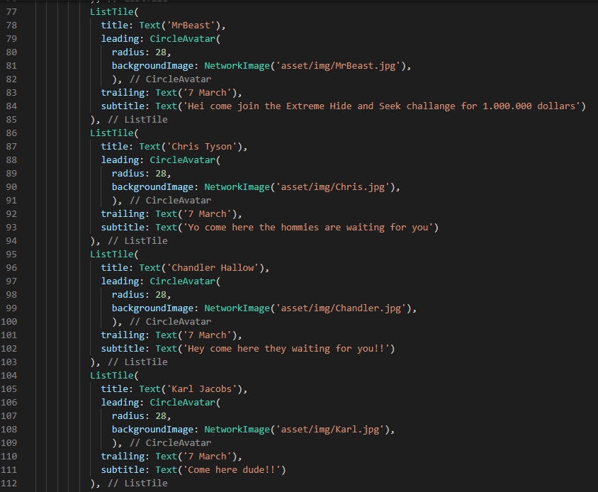
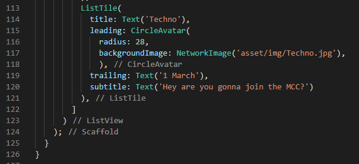
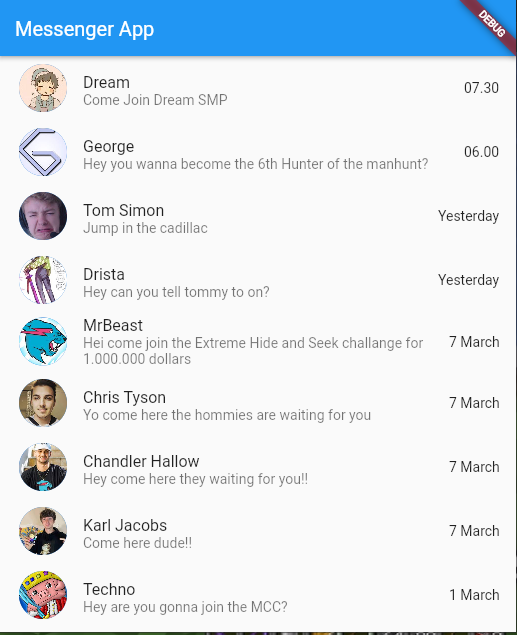

### Buat tampilan UI menggunakan GridView
Di task kedua kodingannya hampir mirip dengan task 1 tinggal mengubahnya dari ListView menjadi GridView.count untuk isinya dari ListTile menjadi container dan untuk isi dari container saya menggunakan icon, lalu margin saya insets all 40 sedangkan borderRadius 25. Untuk count dari GridView itu 4, hasilnya bisa dilihat di screenshoot.
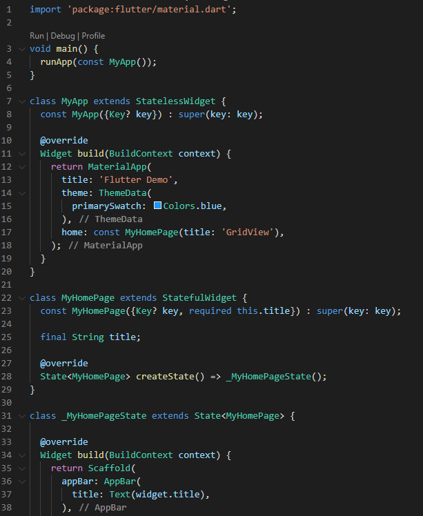
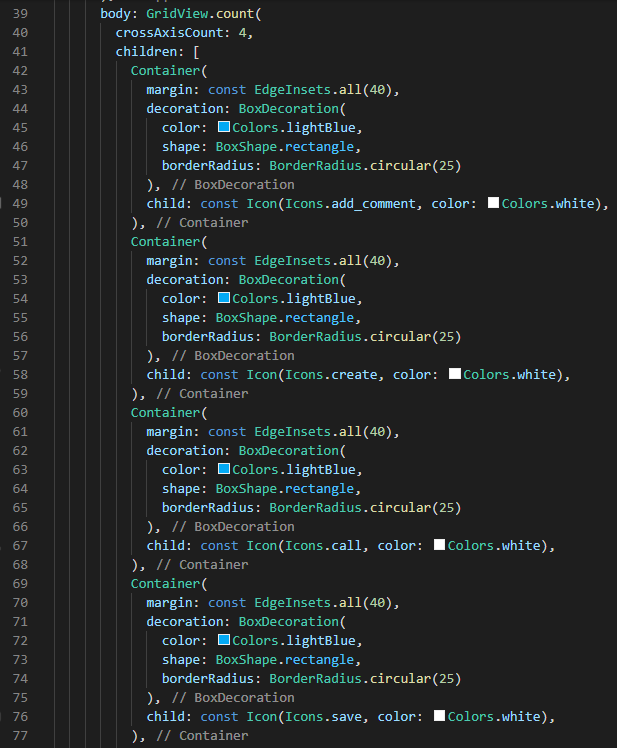
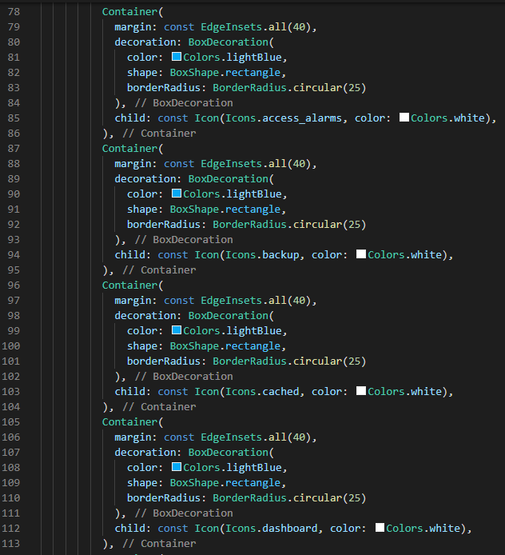
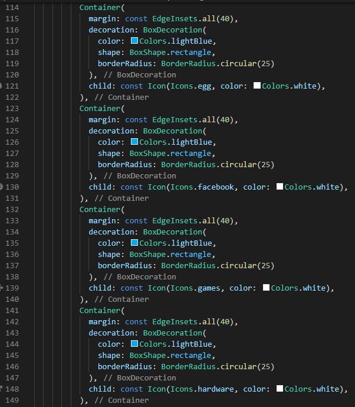
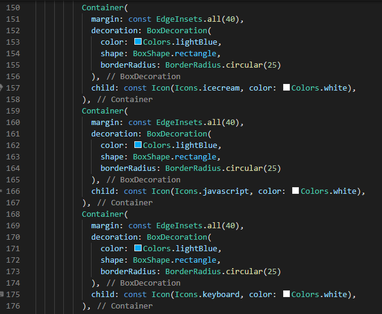
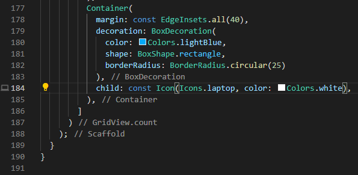
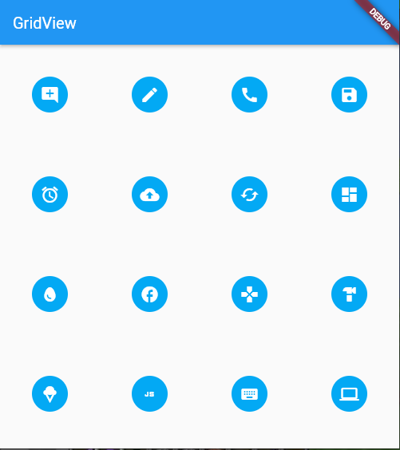

# Resume
- Mempelajari Layout-Layout flutter
- Mempelajari Single child layout Container, Center dan SizedBox
- Mempelajari Multi child layout Column, row, ListView dan GridView