# 15_Dialog_Bottom_Sheet

# Essay

## Task

### Buat tampilan Galery
Di task pertama ini untuk membuat galeri, saya menggunakan GridView.builder untuk membuat galerynya lalu untuk gambar-gambarnya saya simpan dalam sebuah list. Bisa di lihat untuk hasilnya.
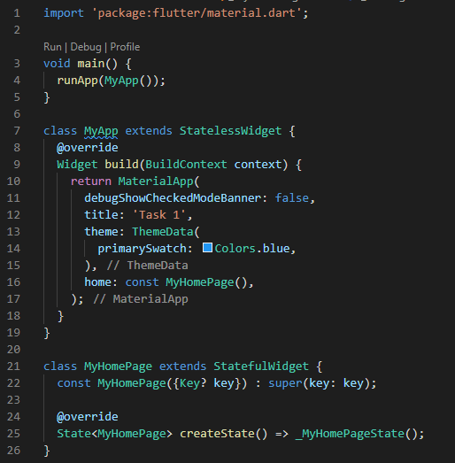
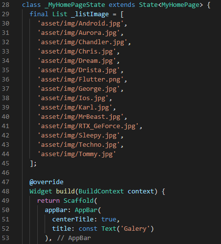
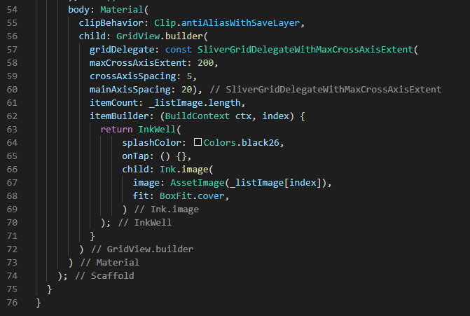
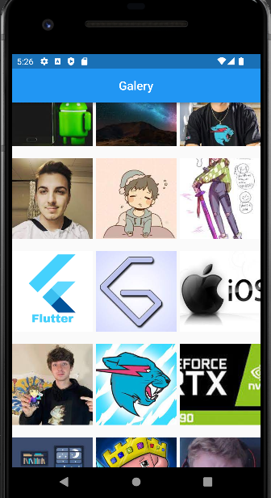

### Buat BottomSheet dengan menampilkan gambar yang ditekan
Di task kedua saya membuat GridView.counter dengan counternya 2 lalu untuk menampilkan BottomSheet saya menggunakan ShowModalBottomSheet, untuk isinya saya menggunakan padding dan column untuk membuat bottomsheetnya agak rapi dan untuk gambarnya saya bungkus dalam container. Hasilnya bisa di lihat berikut:
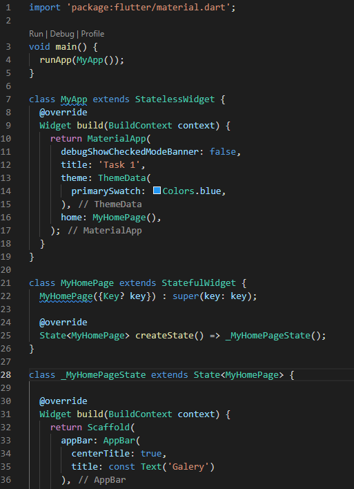
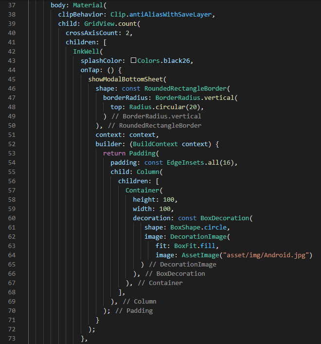
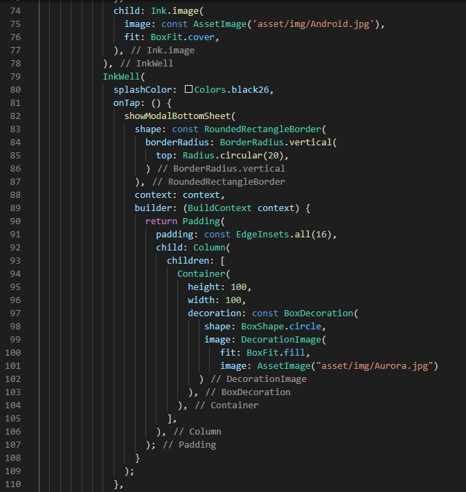
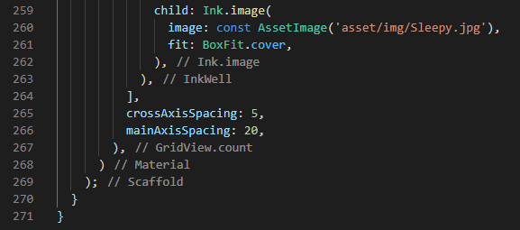

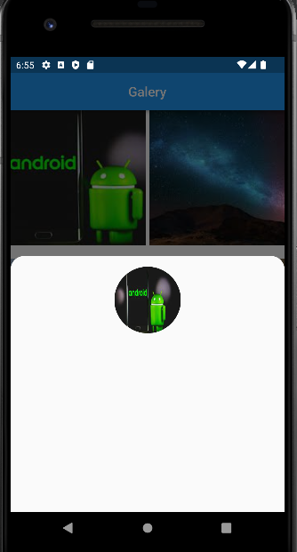

### Buat Dialog dengan menampilkan gambar yang ditekan
Di task ini mirip dengan task 2 namun saya mengubah ShowModalBottomSheet menjadi ShowDialog untuk menampikan dialognya, ShowDialog ini saya menggunakan AlerDialog untuk menampilkan gambarnya. Hasilnya bisa di lihat berikut:
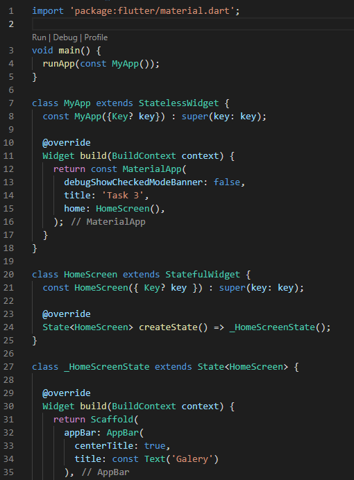
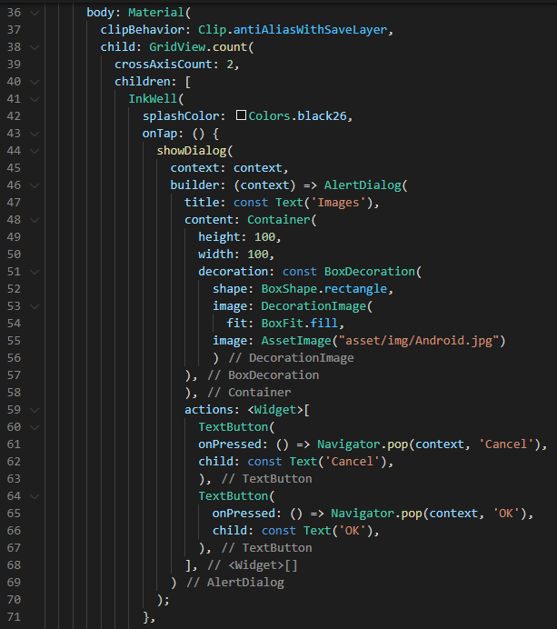
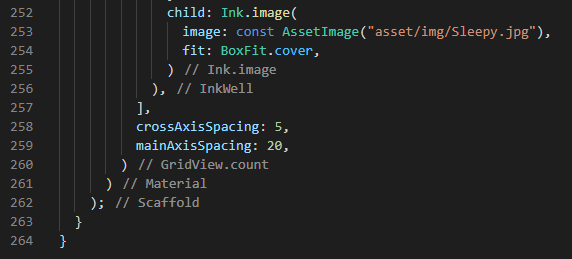

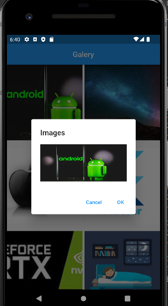

# Resume
- Mempelajari Cara kerja dari Task Management
- Mempelajari BottomSheet dari flutter
- Mempelajari Dialog dari Flutter