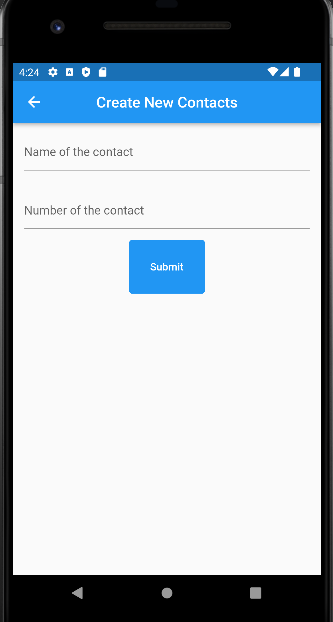

# 16_Form_Input_Button

# Essay

## Task

### Buat tampilan Kontak
Di task pertama ini untuk membuat kontak, saya  membuat list kontak dengan membuat class kontak di models.dart. Setelah itu di main.dart saya membuat ListView.builder dengan mereturn ListTile dan memasukkan list kontak kedalam ListTile. Bisa dilihat di screenshoot.

### Dari task1 tambahkan tombol yang mengarahkan ke halaman baru untuk membuat kontak
Di task kedua ini mengambil dari task1 hanya saja untuk bagian HomePagenya ditambahkan floatingActionButton untuk menambah kontak lalu untuk di halaman menambah kontak saya memberi nama CreateContacts dengan menampilkan dua buah TextField dan satu submit button. Hasilnya bisa di lihat berikut:

# Resume
- Mempelajari TextField dan TextFormField
- Mempelajari Radio, Checkbox dan dropdown
- Mempelajari Button(Elevated dan Icon button)