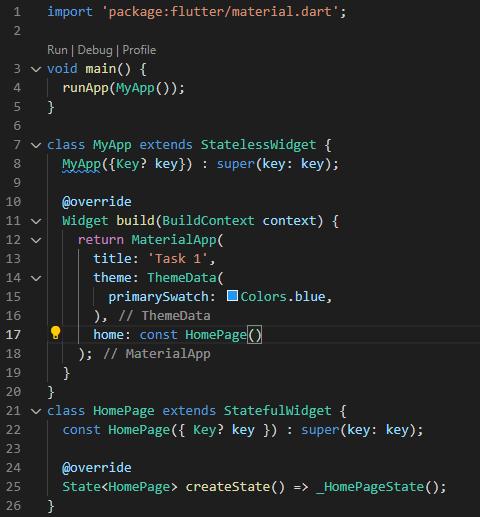
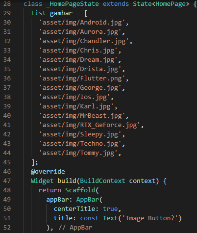
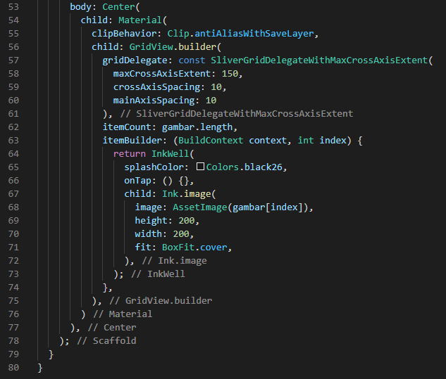
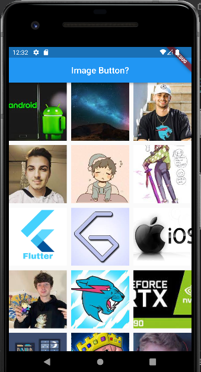
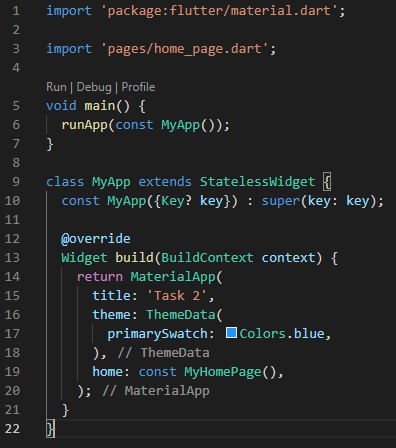
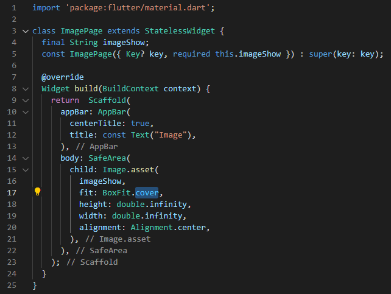
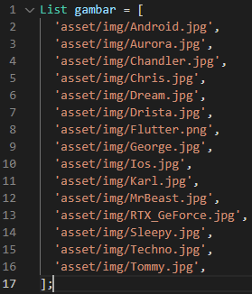

# 18_Assets

# Essay

## Task

### Buat tampilan gallery dengan gambar minimum 3
Di task pertama ini saya membuat list gambar terlebih dahulu, setelah itu ditampilkan menggunakan GridView.Builder lalu menampilkan gambar itu kembali menggunakan inkwell. Hasilnya bisa dilihat berikut:

### Dari task1 tambahkan fitur menampilkan gambar dengan mengklik gambarnya lalu tampilkan memenuhi layar
Di task kedua ini saya memisahkan koding dari task1 bisa dilihat di screenshoot, setelah itu saya menambahkan widget ShowImage untuk menampilkan gambarnya dengan required string image dari asset yang dipilih. Hasilnya seperti berikut:

# Resume
- Mempelajari Assets flutter
- Mempelajari Image flutter
- Mempelajari Font flutter