# 19_Flutter_Navigation

# Essay

## Task

### Buat tampilan contact dan create contact tanpa navigation pushNamed
Di section kali ini task 1 dan 2 saya gabungkan, saya gunakan beberapa packages dari pub.dev untuk memudahkan task kali ini. Packages yang digunakan antara lain provider, formBuilder dan formBuilderValidation. Di halaman utama saya menampilkan kontak dengan ListView.builder dan disusun menggunakan ListTile, lalu floatingButton untuk menambahkan kontak baru. Di page selanjutnya saya gunakan dua packages dari pub.dev yaitu formBuilder dan formBuilderValidation. Hasilnya bisa dilihat berikut:
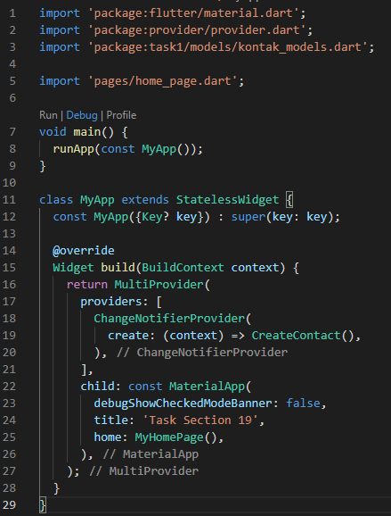
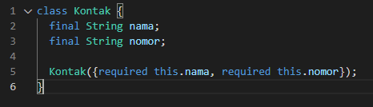
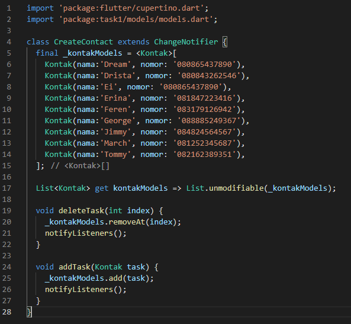
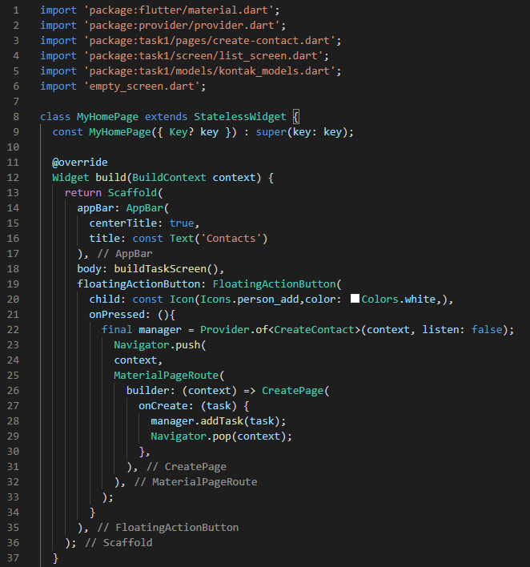
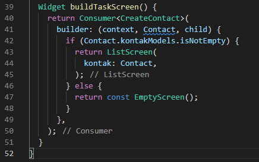
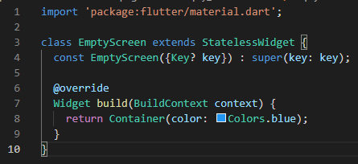
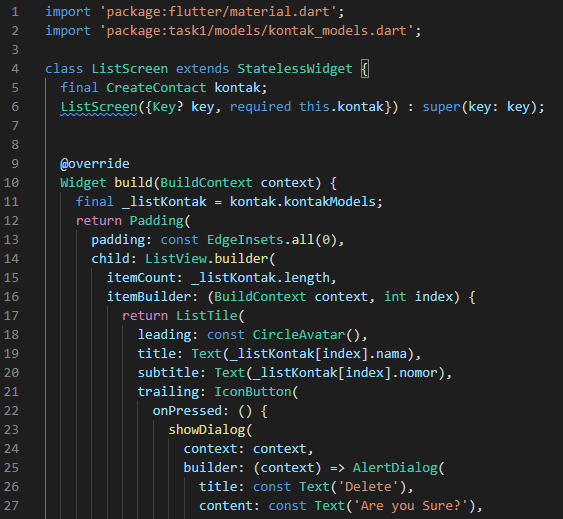
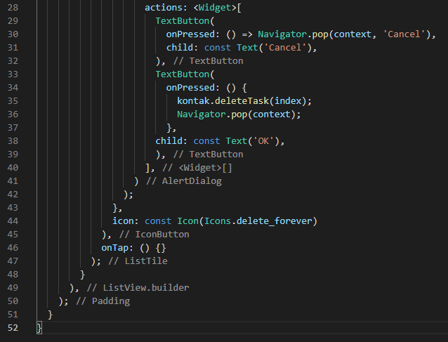
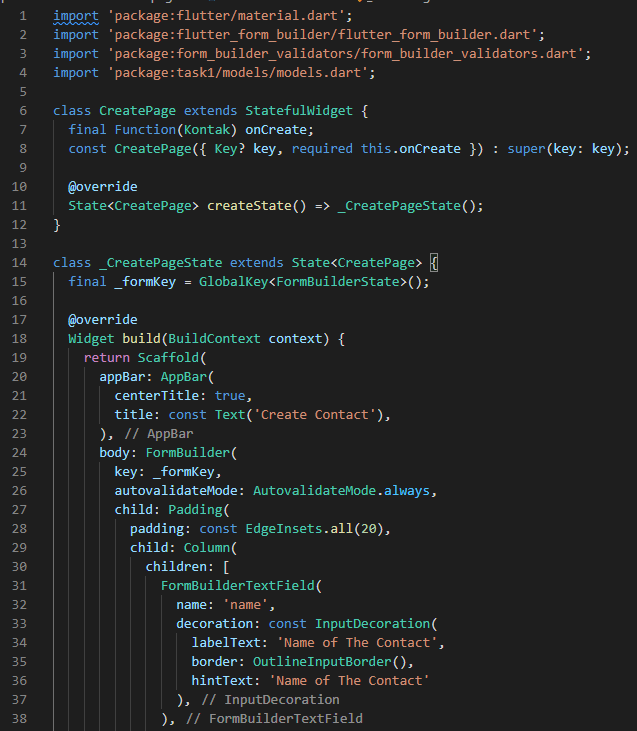
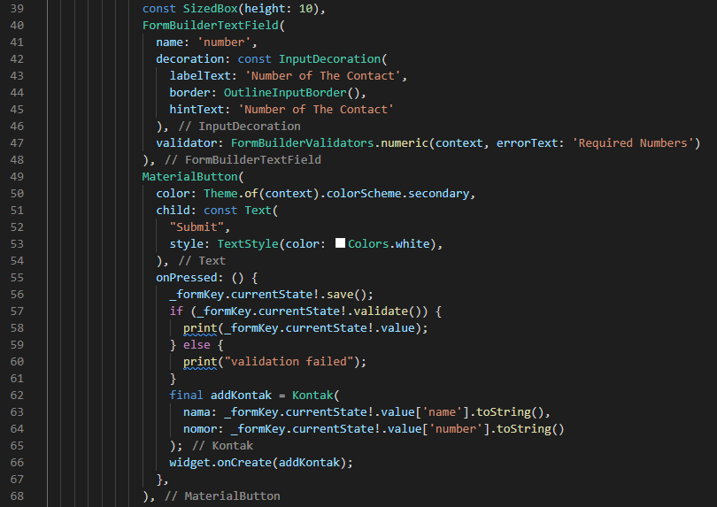
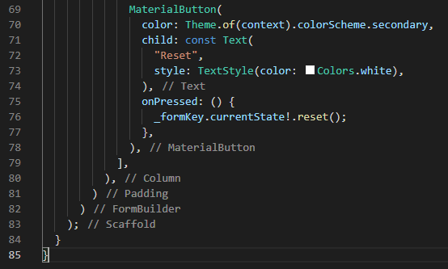
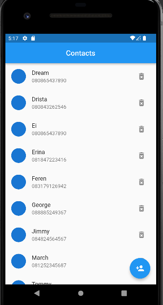
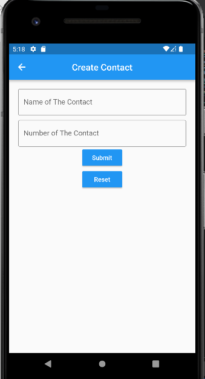

# Resume
- Mempelajari Navigation Dasar
- Mempelajari Navigation Named Routes
- Mempelajari Navigation tanpa Named Routes
