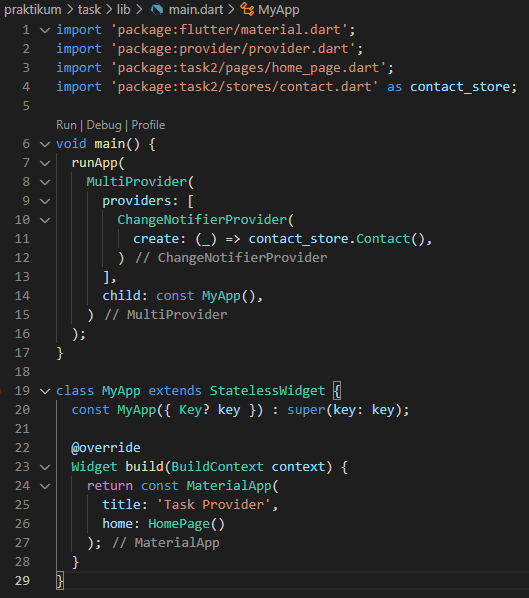
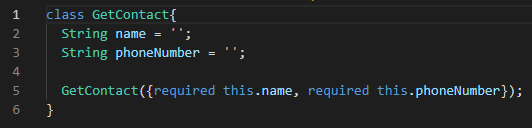
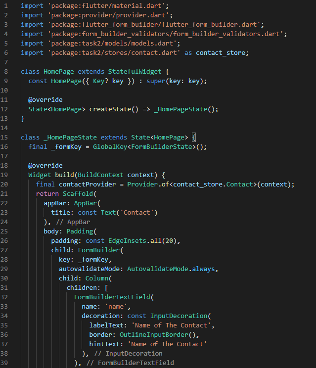
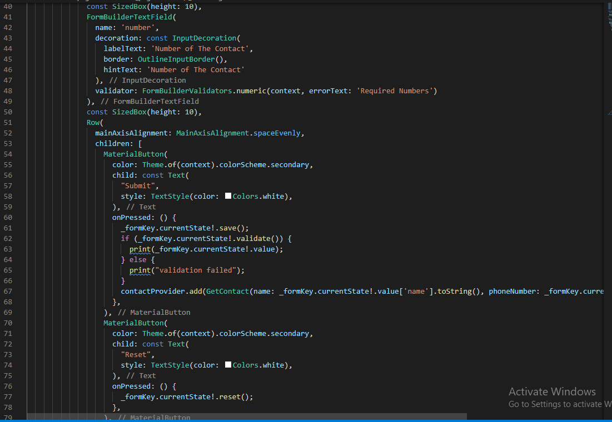
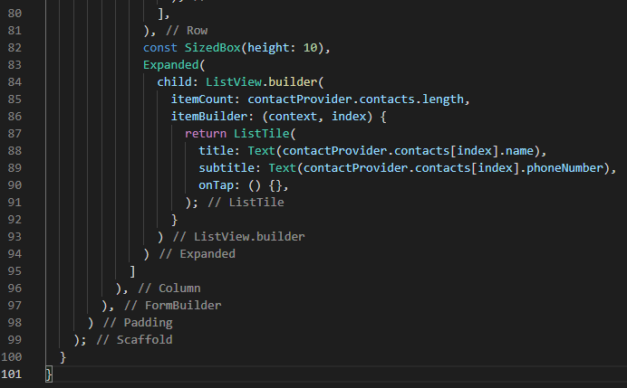
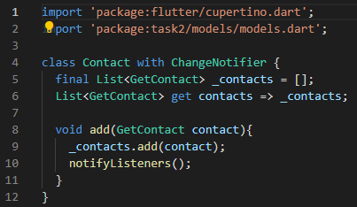
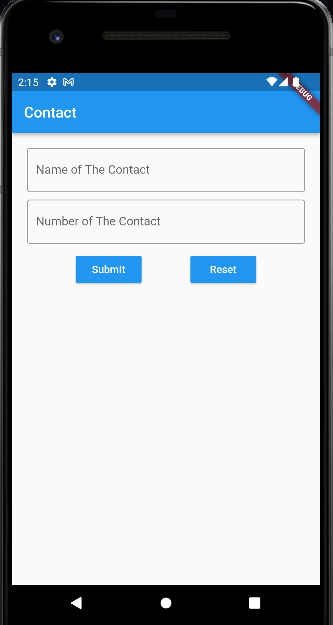
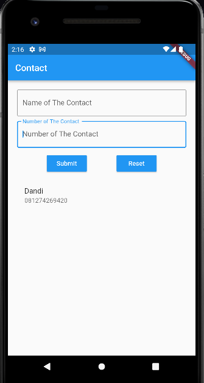

# 20_Flutter_State_Management_(Provider)

# Essay

## Task

### Buat state yang mennyimpan data list contacts pada halaman kontak dan pindahkan state tersebut ke global state
Di section kali ini task 1 dan 2 saya gabungkan, saya gunakan beberapa packages dari pub.dev untuk memudahkan task kali ini. Packages yang digunakan antara lain provider, formBuilder dan formBuilderValidation. Halaman utama saya menampilkan textfield dari formBuilder untuk mengisi nama dan nomor dari kontak, dibawwahnya saya menampilkan kontak yang sudah diabuat dalam widget ListView. Hasilnya bisa dilihat berikut:

# Resume
- Mempelajari State dasar flutter
- Mempelajari Global state
- Mempelajari penggunaan Provider