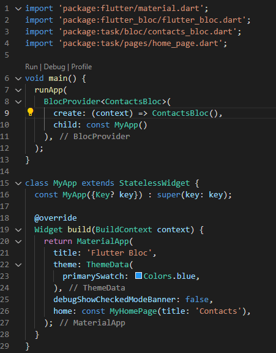
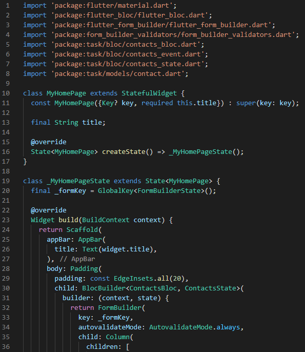
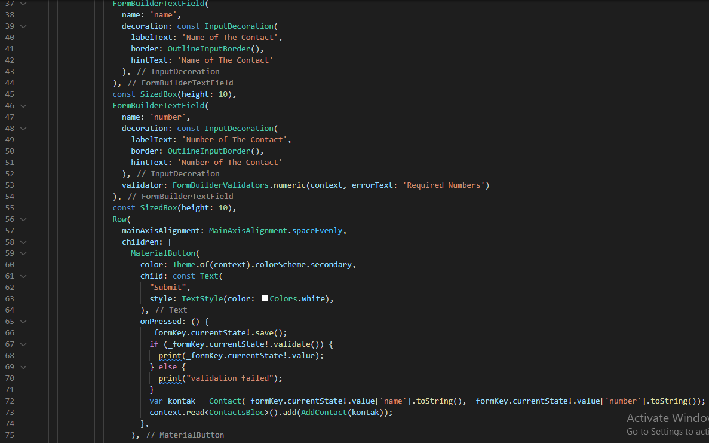
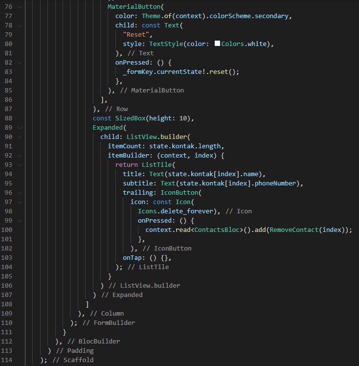
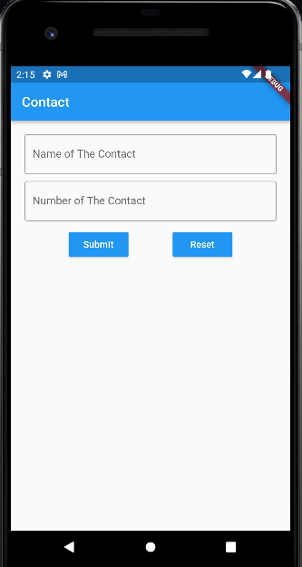
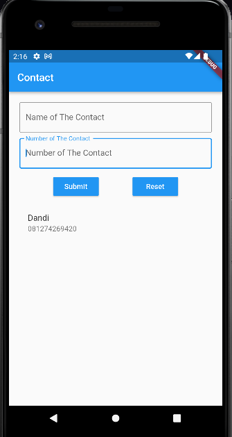
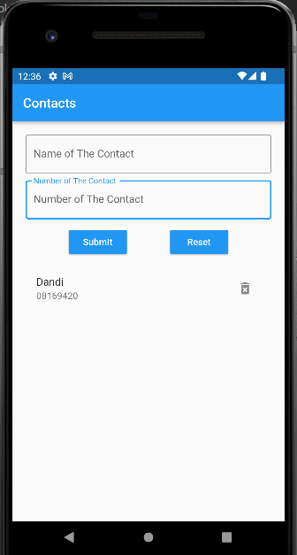

# 21_Flutter_State_Management_(Bloc)

# Essay

## Task

### Buat global state Bloc dan tambahkan satu global state lagi
Di section kali ini task 1 dan 2 saya gabungkan, saya gunakan beberapa packages dari pub.dev untuk memudahkan task kali ini. Packages yang digunakan antara lain provider, formBuilder dan formBuilderValidation. task kali ini saya mengambil referensi dari task section 20 sebelumnya yang membedakan state managementnya menggunakan Bloc dan menambah global state untuk menghapus contact-nya. Hasilnya bisa dilihat berikut:

# Resume
- Mempelajari State management Bloc
- Mempelajari Bloc Stream
- Mempelajari Cara kerja Bloc