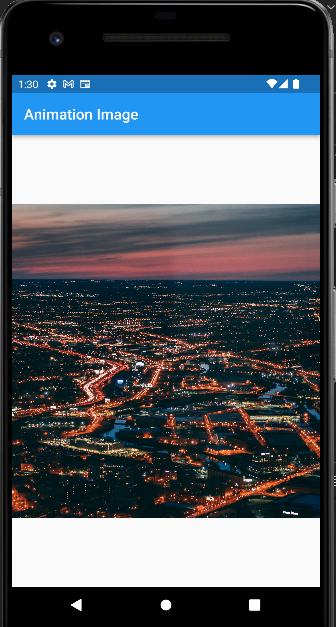

# 22_Flutter_Animation

# Essay

## Task

### Tampilkan gambar kecil di tengah jika diklik membesar dan jika di klik lagi kembali mengecil dan tambahkan animasi
Di task pertama saya mengambil gambar di internet, lalu didalam koding saya pertama buat bool isBig untuk membesar dan kecilkan gambarnya. Selanjutnya membuat widget gestureDetector dengan child center lalu tambahkan gambarnya dan tambahkan animasinya. Hasilnya bisa dilihat berikut:

### Tambahkan animasi transisi dari contact ke create contact
Di task kedua saya mengambil flutter contact dari task section yang sebelum-sebelumnya, lalu pada bagian Navigator push saya tambahkan 3 animasi ada Slide, Fade dan Scale transisi dimana salah satu tidak dijadikan comment dan dua lainnya dijadikan comment jadi bisa memlih transisi yang di inginkan. Hasilnya seperti berikut:

# Resume
- Mempelajari Flutter Animation
- Mempelajari Animasi widget
- Mempelajari Animasi transisi halaman