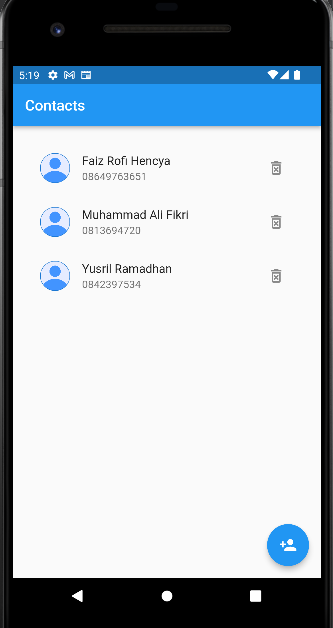
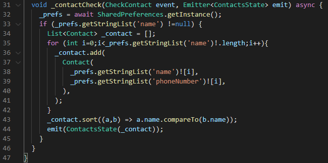

# 23_Storage

# Essay

## Task

### Gunakan Sharedprefences pada state management provider
Di task pertama saya membuat Sharedprefences pada contacts.dart dan menampilkannya pada home_page.dart. Hasilnya bisa dilihat berikut:

### Tambahkan animasi transisi dari contact ke create contact
Di task kedua saya tambahkan event baru pada event yaitu checkContact untuk contact dan checkBlacklist untuk blacklist. Pada bloc saya tambahkan sharedprefences dan event checknya, lalu ditampilkan pada home_page.dart untuk kontak dan blacklist_list.dart untuk blacklist. Hasilnya seperti berikut:

# Resume
- Mempelajari Local Storage
- Mempelajari Sharedprefences
- Mempelajari Local Database (SQLite)