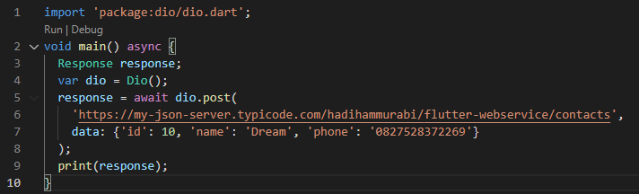

# 24_Introduction REST API – JSON serialization/deserialization

# Essay

## Task

### Lakukan POST request menggunakan dio untuk mengirimkan data contact
Di task pertama mirip dengan modul namun bedanya disini saya gunakan Dio.get() dengan Dio ditampung ke variabel terlebih dahulu. Hasilnya bisa dilihat berikut:

### Ubah bentuk JSON ke dalam object suatu class
Di task kedua saya tambahkan class Contact dengan isinya sesuai json lalu mengubah jsonnya menggunakan factory Contact.fromJSON() dan menampilkannya menggunakan bantuan package http dan json.Decode. Hasilnya seperti berikut:

# Resume
- Mempelajari REST API
- Mempelajari HTTP dan DIO
- Mempelajari JSON serialization/deserialization