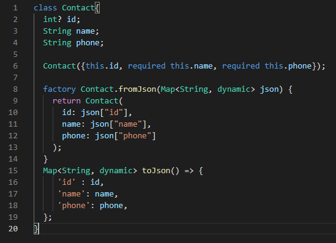

# 25_MVVM Architecture

# Essay

## Task

### Ubah Contacts menjadi struktur MVVM dan gunakan view model pada halaman lain
Di section 25 saya gabungkan tasknya, pertama saya membuat struktur mvvm terlebih dahulu lalu memasukkan coding yang sudah digunakan pada task sebelumnya pada codingan dart yang sesuai. Disini saya gunakan provider untuk state managementnya lalu untuk API yang saya gunakan adalah https://api.jepriana.com/contacts, API dari mentor(Pak Jepriana) lalu saya tambahkan POST, GET, PUT dan DELETE. Hasilnya bisa dilihat berikut:

# Resume
- Mempelajari Struktur MVVM
- Mempelajari View Model dari MVVM
- Mempelajari Implementasi MVVM