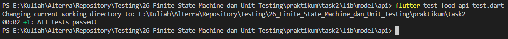

# 26_Finite State Machine & Unit Testing

# Essay

## Task

### Buatlah MVVM sesuai dengan JSON "https://my-json-server.typicode.com/hadihammurabi/flutter-webservice/foods"
Di task pertama saya buat terlebih dahulu struktur MVVM lalu untuk food_model.dart saya sesuaikan dengan json dan juga food_api.dart-nya. Untuk bagian food_view_model.dart saya tambahkan finite state machine, lalu untuk food_screen.dart saya tambahkan finite state machinenya juga. Hasilnya bisa dilihat berikut:

### lakukan unit testing pada mvvm task1 dengan menggunakan mocking
Di task kedua saya buat file baru yaitu food_api_test.dart isinya saya gunakan group test, pada food_api.dart hapus static pada fungsi future. Setelah itu saya lakukan flutter build_runner build untuk membuat mocking, setelah mocking berhasil dibuat saya tambahkan beberapa code lagi pada food_api_test.dart. Hasilnya seperti berikut:

# Resume
- Mempelajari Finite State Machine
- Mempelajari Unit Testing
- Mempelajari Mocking
