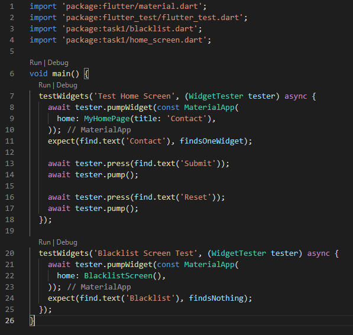

# 27_UI Testing

# Essay

## Task

### Test Ui yang pernah dibuat dan lakukan test juga pada halaman baru yang belum dibuat
Di task section kali ini saya gabungkan untuk task 1 dan 2. Untuk task 1 saya gunakan projek pada task 1 section 20, untuk yang di testnya adalah judul dan 2 button yang ada pada home_screen.dart. Untuk task 2 saya buat blacklist.dart dengan isinya hanya statefull widget yang cuman mereturn Container tanpa ada isinya, untuk testnya saya lakukan pencarian judulnya lalu di matchernya adalah findsNothing. Hasilnya bisa dilihat berikut:

# Resume
- Mempelajari UI Testing
- Mempelajari Cara melakukan UI Testing
- Mempelajari Testing UI yang berhasil dan UI yang gagal