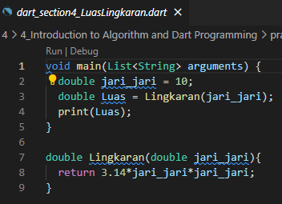
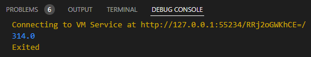
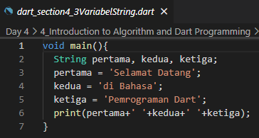
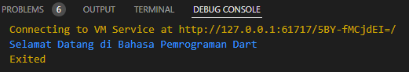

# 5_Basic Dart Programming

# Essay

## Task

### Implementasikan luas lingkaran pada pemrogramaan dart
Di task ini pertama saya membuat prosedur Luas Lingkaran dimana diprosedur tersebut menyimpan rumus dari luas lingkaran, lalu pada bagian main programnya sama mengimplementasikan int jari-jari dan mengisi nilainya, setelah itu panggil prosedur lingkaran dan mengoutputkan hasilnya.

### Buat 3 buah string lalu gabungkan dan tampilkan hasilnyaS
Disini saya membuat string dengan nama pertama, kedua dan ketiga lalu saya inputkan beberapa kata ke masing-masing string dan mengoutputkan ketiga string tersebut

# Resume
- Mempelajari basic dart programming
- Mengetahui variabel-variabel dalam dart programming
- Memahami Async-Await, List dan Map dari dart programming
