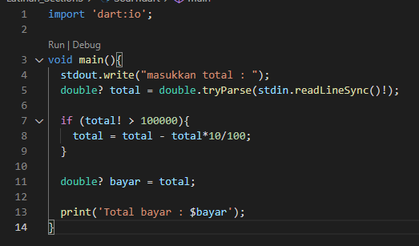
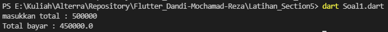
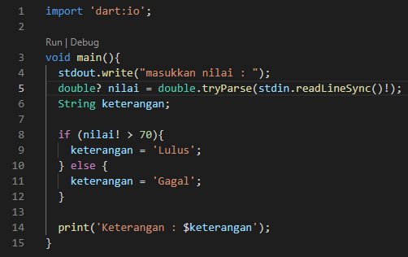
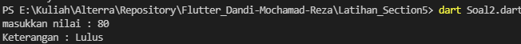
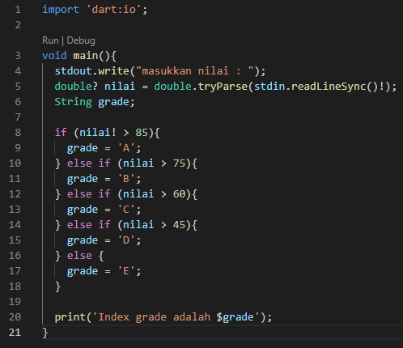
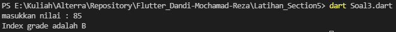
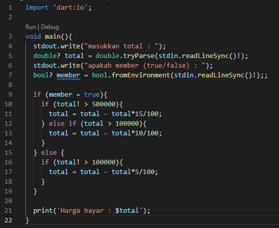
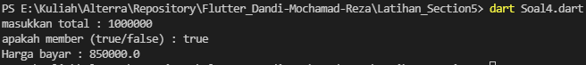
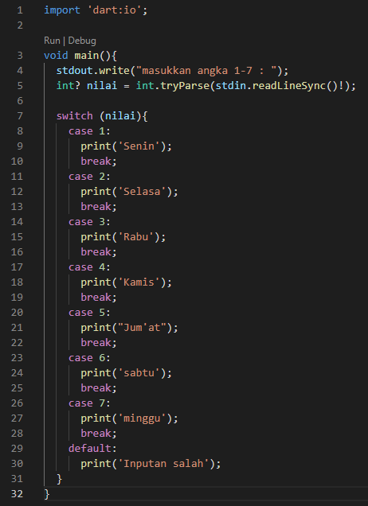
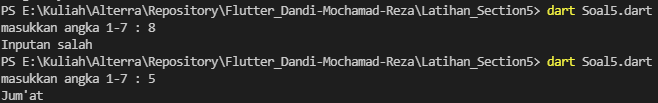

# 6_Branching-Looping-Function

# Essay

## Task

### Masukkan sebuah nilai dan tentukan indexnya sesuai dengan ketentuannya
Pada task ini disuruh untuk membuat branch(if-else) dengan menginputkan nilai dan ditentukan indexnya. Untuk peraturan indexnya jika nilai>70 return A, nilai>40 return B, nilai>0 return C dan selain itu return teks kosong.
Untuk solusinya pertama saya kasih input nilai yang diinginkan lalu branching menggunakan if-else if-else dan mengoutputkan hasil indexnya.

### Tampilkan nilai faktorial dari 10,20.30
Untuk task ini disuruh ubtuj membuat program yang bisa menghasilkan nilai faktorial.
Solusinya saya gunakan fungsi untuk mereturn nilai faktorialnya dan memasukkan hasil faktorialnya kedalam variabel dan mengoutputkan nilainya.

# Resume
- Mempelajari mengenai branching(If-Else-Else if)
- Mempelajari mengenai Looping(for, while, do while)
- mempelajari mengenai Function

# Soal Latihan Section 5 saat live session

## Soal 1

## Soal 2

## Soal 3

## Soal 4

## Soal 5

