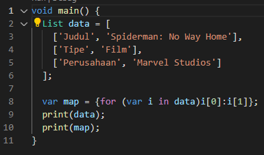
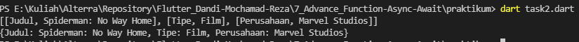

# 7_Advance Function-Async-Await

# Essay

## Task

### Membuat Fungsi dengan beberapa kentetuan
Di task pertama ini disuruh membuat program dart dengan fungsi yang menerima dua parameter yaitu list data dan pengali, Lalu lakukan pengulangan secara asynchronous dengan setiap perulagan data dikali dengan pengali dan lakukan return dari hasil list data yang dikali.

### Buat map dengan berisikan list dengan beberapa ketentuan
Di task kedua ini disuruh membuat map berisi list dengan list memiliki element berupa list juga dan minimal dua tipe sub-element. Untuk itu saya membuat list lalu dimasukkan nilai-nilai yang saya inginkan terus masukkan ke map.

# Resume
- Mempelajari Advance Function(Async-Await, Future)
- Mempelajari List
- Mempelajari Map
