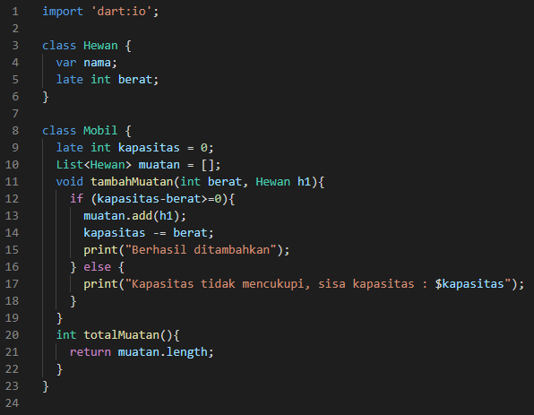
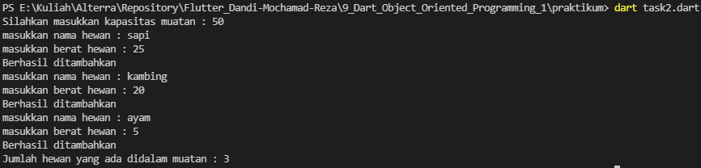

# 9_Dart_Object_Oriented_Programming_1

# Essay

## Task

### Buat Class Hewan dan Mobil
Di task pertama ini saya membuat class hewan dengan property nama dan berat, sebenarnya berat saja cukup tapi agar tidak ambigu saat nanti dimasukkan ke list maka saya menambahkan property nama.
Lalu untuk class mobil di isi sesuai ketentuan yaitu property kapasitas dan list muatan beserya method tambahMuatan.
Di void main saya menambahkan input/output untuk memasukkan berbagai nilai dan jika berat hewan masih lebih besar dari sisa kapasitas muatan maka hewan tersebut bisa ditambahkan.

### Tambahkan method totalMuatan
Di task kedua ini tinggal membuat method totalMuatan pada class mobil, dimana method tersebut merupakan jumlah hewan yang ada didalam muatan.

# Resume
- Mempelajari Object Oriented Programming dart
- Mempelajari Class
- Mempelajari Property dan method dalam class
