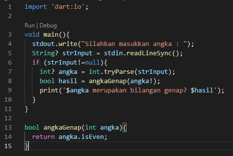
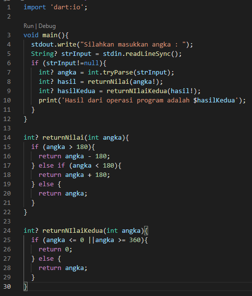
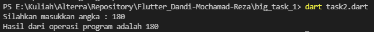
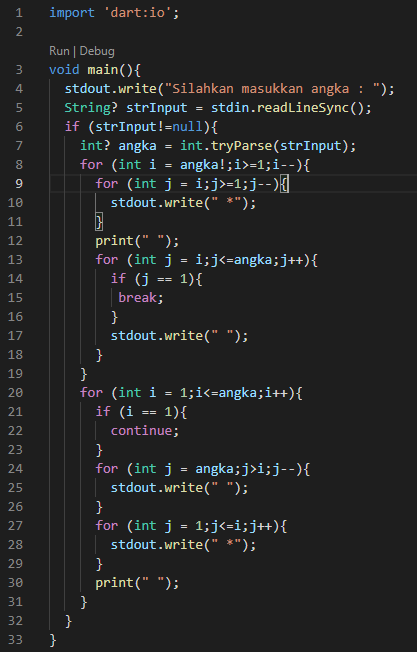
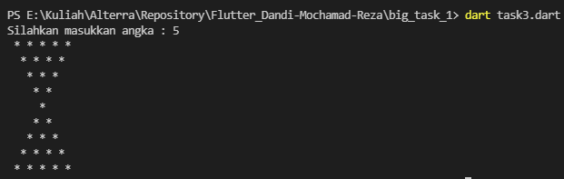
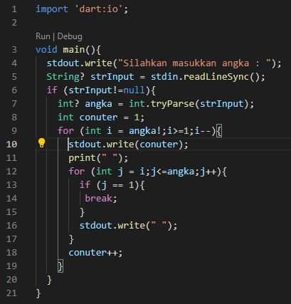
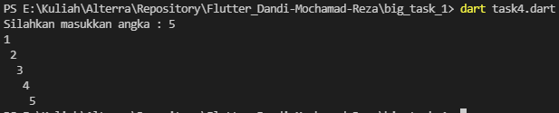

# big_task_1

# Essay

## Task

### Ganjil atau Genap
Di task ini disuruh membuat program ganjil atau genap, Saya membuat fungsi dimana mereturn boolean false atau true, true jika genap dan false jika salah.

### Azimuth/Back-Azimuth
Di task kedua ini saya membuat 2 fungsi, fungsi pertama mereturn jika nilai >180 akan dikurangi 180, jika nilai <180 akan ditambahkan 180 jika yang lainnya return angka tersebut, fungsi kedua jika nilai <0 atau >360 maka return 0 jika yang lainnya maka return angka tersebut.

### Jam Pasir
Di task ketiga ini saya membuat 2 perulangan dan didalam 2 perulangan tersebut ada perulangan lagi.

### Diagonal Angka
Di task keempat ini mirip seperti task 3 tapi ada 1 perulangan dan dalamnya ada 1 perulangan lagi dengan menampilkan angka dari 1 sampai angka yang dimasukkan user.

